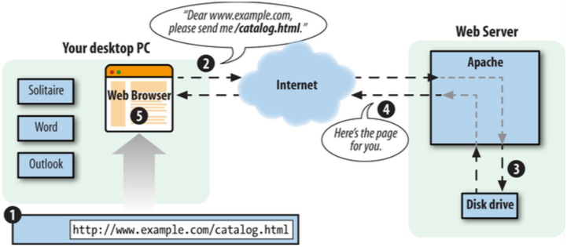

# What is Server-side Programming?

Server-side scripting is a technique used in web development which involves employing scripts on a web server which produce a response specific to each user \(client\) request to the website. Scripts can be written in any of a number of server-side scripting languages that are available like ASP.NET, Ruby, Python, and many more.

## PHP’s Place on the Web

Everytime you work on your computer and access a web page using a browser such as Safari, Chrome or Firefox, you open a conversation over the Internet between your computer and a server \(another computer\). This interaction is illustrated in Figure 2.1.\(Sklar, 2016\).

_Figure 2.1_

The following steps is what is happening in the illustration above:

1. You type www.example.com/catalog.html into your browser’s location bar.
2. The browser sends a message over the Internet to the computer named www.example.com asking for the /catalog.html page.
3. Apache HTTP Server, a program running on the www.example.com computer, gets the message and reads the catalog.html file from its disk drive.
4. Apache sends the contents of the file back to your computer over the Internet as a response to the browser’s request.
5. Your browser displays the page on your screen, following the instructions of the HTML tags in the page \(Sklar, 2016\).

However this process changes when we introduce PHP into the mix. PHP gets done on the server side and managed by Apache \(Sklar, 2016\), the PHP generates the final webpage that we will view \(commonly in cooperation with MySQL\). This process looks more like the illustration in Figure 2.2.

**IMAGE**

_Figure 2.2_

The process in Figure 2.2 follows the following steps.

1. You type www.example.com/catalog/yak.php into your browser’s location bar.
2. Your browser sends a message over the Internet to the computer named www.example.com asking for the /catalog/yak.php page.
3. Apache HTTP Server, a program running on the www.example.com computer, gets the message and asks the PHP engine, another program running on the www.example.com computer, “What does /catalog/yak.php look like?”
4. The PHP engine reads the file yak.php from the disk drive.
5. The PHP engine runs the commands in yak.php, possibly exchanging data with a database program such as MySQL.
6. The PHP engine takes the yak.php program output and sends it back to Apache HTTP Server as an answer to “What does /catalog/yak.php look like?”
7. Apache HTTP Server sends the page contents it got from the PHP engine back to your computer over the Internet in response to your browser’s request.
8. Your browser displays the page on your screen, following the instructions of the HTML tags in the page \(Sklar, 2016\)

All in all what is happening is that when you as a developer write PHP into your website, the server will use the PHP engine \(Zend Engine\) to decipher the PHP into the final website code and instructions to send to the Client-Side \(browser\).

